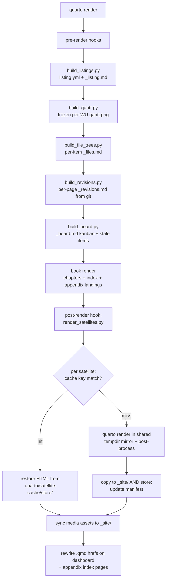

# Render pipeline

The repo is a Quarto **book** project with a twist: only
`chapters/**/*.qmd` (+ `index.qmd` and three appendix landings) are
book pages. Everything in `initiatives/` and `updates/` renders as
**satellite pages** — standalone HTML emitted by a post-render hook —
because Quarto book projects don't render files outside
`book.chapters`/`book.appendices`.

## The satellite cache

`render_satellites.py` fingerprints every satellite into a cache key
and skips the (expensive) per-page `quarto render` subprocess when
nothing changed. Measured effect: a no-change full render's satellite
phase drops from ~230 s to under 1 s.

**Per-satellite key** = sha256 over:

1. the source `.qmd` bytes,
2. every sibling generated `_*.md` partial (`_listing.md`,
   `_files.md`, `_revisions.md`) — presence/absence included,
3. size+mtime of sibling asset dirs (`data/ images/ videos/ media/`)
   and loose non-underscore files,
4. the computed back link (href + the *parent* page's title — renaming
   an epic re-renders its children),
5. for WU decks: size+mtime of `../../initiatives/...` **media** files
   the deck references (linked `.qmd`/`.md` pages are excluded — links
   are never inlined into the HTML).

**Global key** (mismatch invalidates everything): a `CACHE_SCHEMA`
constant, the sha256 of `render_satellites.py` itself, and the Quarto
version.

> **RULE — keep this invariant when extending the pipeline:**
>
> 1. Anything new that is copied into the shared tempdir mirror for
>    *all* satellites (e.g. a future shared `_metadata.yml` or style
>    asset) must be added to `global_key()`.
> 2. Any new *generated* input must be written via
>    `_lib.write_text_if_changed` / `write_bytes_if_changed`. An
>    idempotent regeneration that rewrites identical bytes (or bumps an
>    mtime) silently turns every render into a full rebuild.

Cache storage: `.quarto/satellite-cache/{manifest.json, store/}`
(gitignored). The store holds the *post-processed* outputs so a cache
hit can restore pages even after `_site/` is wiped. `thesis.ps1
cache-clear` deletes it; the next render rebuilds everything.

Binary assets are fingerprinted by size+mtime, not content — media
runs to gigabytes. Worst case (fresh clone resets mtimes) is one
spurious re-render, never a stale page.

## Fast paths

| Need | Command |
|---|---|
| Full site, warm cache | `.\thesis.ps1 render` (HTML-only; the PDF LaTeX pass runs only with `render pdf`) |
| One satellite while iterating | `.\thesis.ps1 render-one A5-EX-002` (regenerates partials, then renders just the matching page) |
| One chapter while iterating | `.\thesis.ps1 render-one chapters/03-operation/sops/SOP-01-head-install.qmd`, or `quarto preview` for live reload |
| Suspected stale page | `.\thesis.ps1 cache-clear`, then render |

## Why satellites render in a tempdir mirror

Rendering each satellite *inside* the repo would put it in scope of
the book's `_quarto.yml` (wrong layout, wrong nav). The hook instead
builds ONE tempdir mirror of `initiatives/` (assets only, no `.qmd`)
per run and renders each dirty satellite there, so cross-tree relative
URLs (a WU deck embedding an experiment's video) resolve identically.

**Conditional `embed-resources`:** deep experiment pages + WU decks
render self-contained (no `<stem>_files/` dir — Windows MAX_PATH
protection); initiative/epic hub pages keep a real `_files/` dir
because they embed PDFs via relative `<iframe>` srcs, which break as
`data:` URIs. A satellite can opt out per-file with
`embed-resources: false` front matter.

**GitHub Pages guard:** files > 95 MB never ship to `_site/` (Pages
rejects 100 MB blobs); deck videos play via Google Drive iframes (see
[workflow-weekly-update.md](workflow-weekly-update.md)).

## Troubleshooting

- *Fresh clone: `quarto render` fails with "Include directive failed …
  could not find _board.md"*: Quarto expands book-page includes at
  CONFIG time, before the pre-render hooks generate the partials. Run
  `.\thesis.ps1 doctor` (or `render`) once — it primes the generators —
  or run the five `build_*.py` scripts manually on non-Windows.
- *`_site/` has no `index.html`, just the PDF*: a bare
  `quarto render --to pdf` cleans `_site/` and emits only the PDF
  (stock Quarto project-render behavior). Use `.\thesis.ps1 render
  pdf` (renders HTML + PDF together) or follow up with
  `.\thesis.ps1 render` — the satellite cache restores the PM pages
  without re-rendering them.
- *Every render re-renders all satellites*: something rewrites a
  shared input each run. Check the pre-render hook output — every line
  should read `Unchanged ...` on a no-op run; a `Wrote ...` line names
  the offender.
- *A page looks stale*: confirm its inputs actually changed (the key
  covers source + partials + assets + parent title), then
  `cache-clear` and re-render; if that fixes it, file an issue against
  the key computation in `render_satellites.py`.
- *Render fails inside the hook*: run it directly for a readable
  trace: `.venv\Scripts\python.exe scripts\render\render_satellites.py
  --only <page>`.
