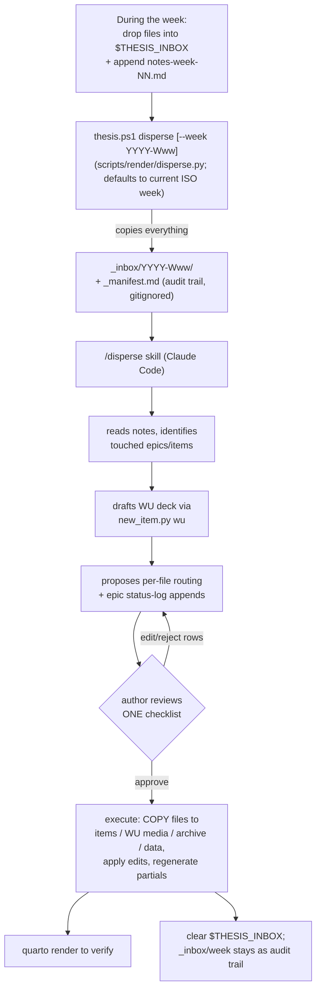

# Inbox dispersal — raw files → organized tree

During the week, raw evidence (photos, videos, CAD, notes) accumulates
in `$THESIS_INBOX` (an OneDrive folder reachable from phone / lab PC /
laptop). On update day it gets **staged** deterministically, then
**routed** with judgement — a script does the first, a Claude Code
skill plus the author do the second.

## Division of labor (do not blur it)

| Step | Who | Nature |
|---|---|---|
| Stage | `scripts/render/disperse.py` | Deterministic: copies *every* file, writes `_manifest.md`, never routes |
| Route | `/disperse` skill | Judgement: proposes destinations + WU draft; **stops for approval** |
| Execute | skill, post-approval | Copies (never moves) out of `_inbox/`; `_inbox/<week>/` is the audit trail |

## Routing destinations

- Evidence for an existing item →
  `…/<item>/{images,videos,data,media}/`, renamed to
  `<item-id>-IMG|VID|DATA-<slug>.<ext>`.
- Evidence implying a **new** item → scaffold it with
  `thesis.ps1 new experiment --epic <gid> …` (the skill proposes this;
  it never silently invents epics).
- Illustrates the week itself → `updates/WU-…/media/`.
- Vendor / historical reference → `archive/<bucket>/` (>25 MB files
  get an `archive/external-index.qmd` entry instead).
- Cross-cutting shared data → `data/`.

## Guardrails

- Nothing moves before the author approves the checklist.
- `_inbox/<week>/` is never deleted by tooling.
- Naming conventions are exact (see
  [workflow-item-lifecycle.md](workflow-item-lifecycle.md)); when the
  right epic is unclear, the skill asks instead of guessing.
- Book chapters are never touched during dispersal.
