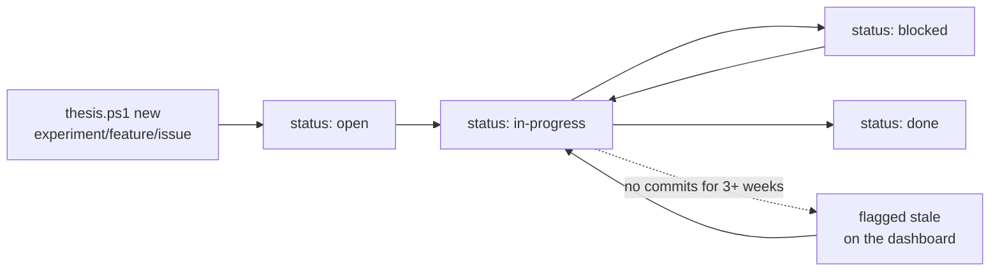

# Item lifecycle — initiatives, epics, items

The PM layer is file-based: an **Initiative → Epic → Item** tree under
`initiatives/`, rendered into the same site as the thesis. Items are
**experiments** (research question), **features** (thing to build), or
**issues** (problem to solve).



## Creating things — always scaffold, never hand-roll

```powershell
.\thesis.ps1 new experiment --epic A5 --slug head-cad-revalidation --title "..."
.\thesis.ps1 new feature    --epic A6 --slug opcua-bridge --title "..."
.\thesis.ps1 new issue      --epic A9 --slug network-drop --title "..." --priority high
.\thesis.ps1 new epic --initiative research-problems --gantt-id A10 --slug thermal-mapping --title "Thermal Mapping"
.\thesis.ps1 new wu   --title "week 3 results"
```

The scaffolder (`scripts/render/new_item.py`) allocates the next free
ID, copies the matching template from `initiatives/_template/`, fills
canonical front matter, and self-checks against `audit_items.py`.
After scaffolding an epic, add its bar to the Mermaid Gantt in
`index.qmd` by hand — the Gantt is the schedule's single source of
truth.

## Directory + ID conventions

| Type | Pattern | Example |
|---|---|---|
| Initiative dir | `<slug>/` (`gantt-section` in front matter) | `example-research/` |
| Epic dir | `<gantt-id>-<slug>/` | `A1-example-epic/` |
| Item dir | `<gantt-id>-<EX\|FE\|IS>-<NNN>-<slug>/` | `A1-EX-001-example-experiment/` |
| Weekly update dir | `WU-YYYY-MM-DD-week-NN/` | `WU-2026-06-12-week-01/` |
| Item media | `<item-id>--<slug>.<ext>` | `A1-EX-001-IMG-trial-01-result.jpg` |

Item IDs are **epic-scoped**: per-epic counter, prefixed by the epic's
`gantt-id` for global uniqueness. The prefix survives copy/paste out
of the repo and stays unique if an item moves between epics. WU week
numbers are **semester-relative** (not ISO weeks) — the scaffolder
infers the next one from existing dirs.

## Front-matter contracts (enforced by `audit_items.py`)

Item README (`type`, dates, `priority` vary by kind):

```yaml
---
title: "Does approach B outperform approach A on metric X?"
item-id: A1-EX-002        # dir-name stem; inferred, never hand-set
type: experiment           # experiment | feature | issue
epic-id: A1-example-epic
initiative: example-research
gantt-id: A1
status: in-progress        # open | in-progress | blocked | done
owner: Jane Doe            # advisory ownership (see below)
date: 2026-06-12           # experiments; features/issues use opened-/closed-date
description: One-liner for listing tables and WU roll-ups.
related-items: [A1-IS-001]
categories: [example]
---
```

Epic README:

```yaml
---
title: "Example Epic"
epic-id: A1-example-epic   # == dir name
initiative: example-research
gantt-id: A1
gantt-dates: [2026-06-01, 2026-07-15]
status: in-progress
owner: Jane Doe
customer: who this epic serves
need: what problem this solves
benefit: the payoff
thesis-chapters: [chapters/01-background/CH-1a-example-section.qmd]
related-epics: [A2-another-epic]
---
```

Initiative README: `title`, `initiative-id` (== dir name),
`gantt-section`, `status`, `owner`, `description`.

`audit_items.py` infers the canonical values from tree position and
gates the pre-commit hook + `publish.py`; `--fix` rewrites in place.
Canonical statuses are exactly `open / in-progress / blocked / done`
(legacy values like `planning`, `complete`, `critical` migrate on
`--fix`; schedule emphasis lives on the Gantt's `crit` tag, not in
`status`).

## Page body conventions

- **Epic README:** `## Background` then `## Status log` (dated
  bullets, newest first, each linking its WU). Done epics add
  `## Resolution`. The generated `_listing.md` include owns the
  `## Experiments / Features / Issues` headings; the generated
  `_revisions.md` include closes the page.
- **Item README:** experiments use Research question / Hypothesis /
  Method / Observations / Outcome / Weekly summaries; features and
  issues use Summary / Investigation / Weekly summaries. The
  `_files.md` then `_revisions.md` includes close the page.
- **Items own all media; epics own none** — every photo/video/CAD file
  lives under the item that evidences it.

## Ownership + revision tables (advisory, git-native)

- `owner:` names the current owner of every initiative, epic, item,
  SOP, and WU. It is **advisory** — nothing blocks another committer;
  it surfaces on listing tables, kanban cards, and each page's change
  history so accountability is visible without process overhead.
- Every owned page ends with an auto-generated **Change history**
  (`_revisions.md`, built by `build_revisions.py` from one `git log`
  pass): owner, then date/author/subject per commit in the page's
  scope. Committed history only — the table updates on the render
  *after* a commit. Scopes exclude children (epic history doesn't spam
  with item commits).
- **SOPs additionally carry a formal engineering revision block** in
  front matter (`revisions:` list: rev letter, date, author,
  `approved-by`, description) rendered by the ``
  shortcode — add a row on material procedure changes and have the
  advisor/lab manager sign `approved-by`. Git history is the forensic
  complement; the rev block is the deliberate record.

## The dashboard board

`build_board.py` (pre-render hook) generates `_board.md`, included by
`index.qmd`: per-initiative epic tables, a four-column kanban of every
item, and a **stale list** — `in-progress` items with no commit in
their directory for 3+ weeks (`--stale-weeks` to tune). Freshly
scaffolded (never-committed) items count as fresh. Edit front matter,
never the generated tables.
