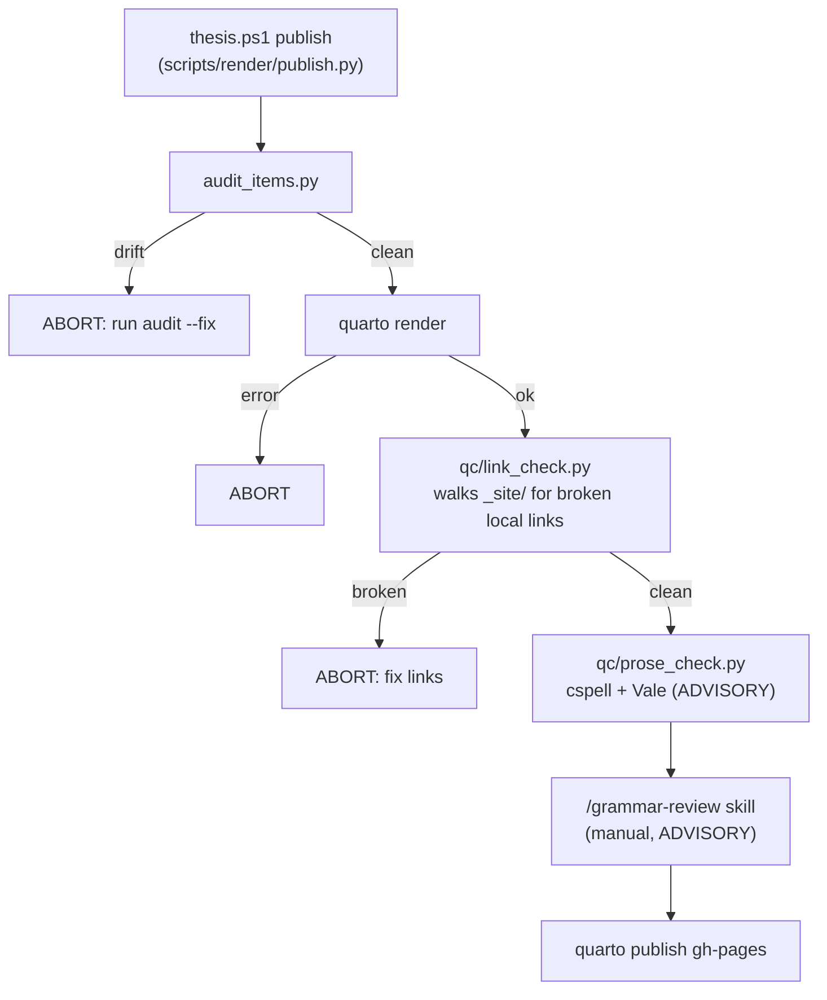

# Publish + QC pipeline

QC runs at publish time, not on-save — the inner loop stays fast
(cspell + LTeX live in the editor). `scripts/render/publish.py`
orchestrates; gating steps abort the publish, advisory steps only
report.

The same audit gate also runs from the pre-commit hook
(`scripts/git-hooks/pre-commit`) whenever `initiatives/` files are
staged, alongside the >50 MB video guard. Bypass (rarely):
`git commit --no-verify`.

## The steps

| Step | Tool | Gate? | Notes |
|---|---|---|---|
| Front-matter audit | `audit_items.py` | **yes** | items + epics + initiatives + SOP rev blocks; `--fix` rewrites |
| Render | `quarto render` | **yes** | full render incl. PDF; satellites come from cache where clean |
| Link check | `qc/link_check.py` | **yes** | regex-walks `_site/` HTML for broken local `href`/`src` |
| Prose check | `qc/prose_check.py` | advisory | wraps `cspell` + `vale` if installed (`npm i -g cspell`) |
| LLM grammar pass | `/grammar-review` skill | advisory | line-numbered issues on changed files; never mutates without approval |
| Publish | `quarto publish gh-pages` | — | needs the repo's gh-pages branch |

## Publishing options

- **Snapshot** — `quarto render`, share the `_site/` zip or the PDF.
  Fine for ad-hoc "here's the current Gantt".
- **GitHub Pages** — `quarto publish gh-pages` (what `publish.py`
  does). Stable URL. Caveat: LFS files don't serve, hence the Drive
  video embeds; the satellite pipeline also skips any >95 MB file.
- **Self-host from the lab PC** — Caddy
  (`:80 { root * C:/thesis/_site; file_server }`) or IIS pointing at
  `_site/`. Serves LFS natively. Not wired up yet.
